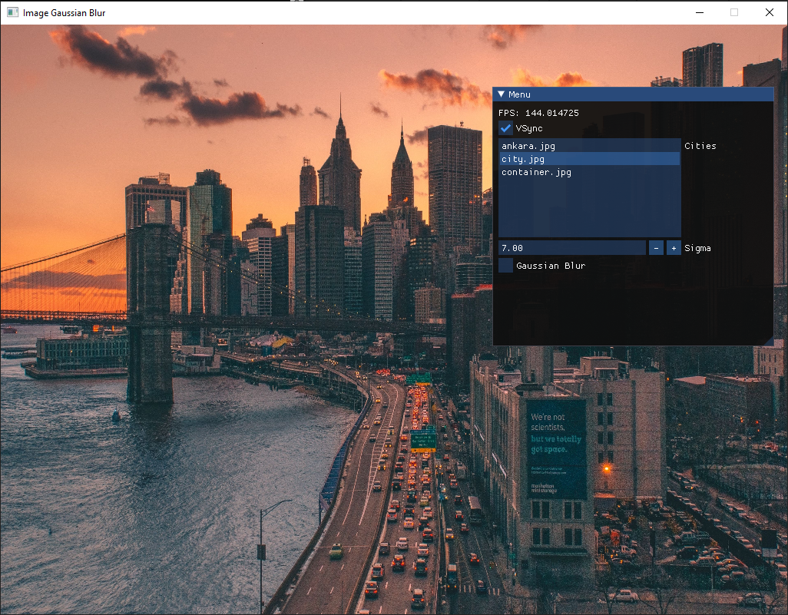

# Gaussian Blur Effect for Images

## Features
- Optimized shaders for the Gaussian Blur effect
- GUI for testing the kernel values
- Save output as a file
- VSync

## External Libraries
- [Glad](https://glad.dav1d.de/)
- [GLFW](https://github.com/glfw/glfw)
- [GLM](https://github.com/g-truc/glm)
- [Dear ImGui](https://github.com/ocornut/imgui)
- [stb_image](https://github.com/nothings/stb)

## Dependencies
- [Premake](https://premake.github.io/)
